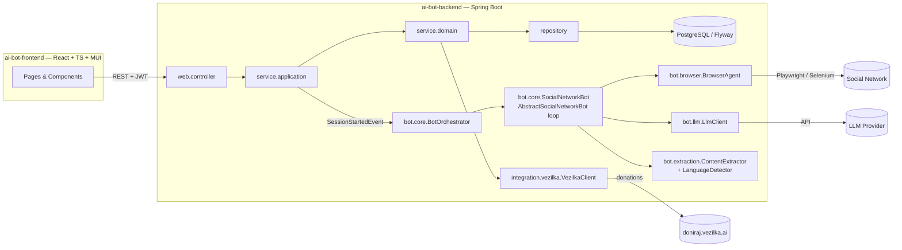

# AI Bot Template — Macedonian Content for doniraj.vezilka.ai

Template for the EMC course project: an **AI bot that intelligently navigates the
interface of a social network** (Facebook, Instagram, X, Reddit, …), **extracts
Macedonian-language content** (posts, images, videos) from the Macedonian online
space, and **donates it to [doniraj.vezilka.ai](https://doniraj.vezilka.ai)** —
the platform for preserving the Macedonian language.

Секој студент добива **една** социјална мрежа (доделена од професорот) и го
имплементира ботот за неа, следејќи ја оваа заедничка архитектура. Оригиналниот шаблон ги означува задачите со `TODO(student)`.
Имплементацијата за gol.mk е опишана подолу.

## This implementation: gol.mk sports bot

The assigned source is gol.mk, represented by `SocialNetwork.SPORTS_PORTAL_GOL`.
The bot extracts public sports articles and keeps their source URLs. It generates
summaries for browsing, but donates the extracted article text.

- `PlaywrightBrowserAgent` drives Chromium and produces link-annotated snapshots,
  limited to 10,000 characters per page.
- `OpenAiCompatibleLlmClient` sends the page, goal and recent action history to the
  configured chat endpoint. It validates decisions and attempts one repair of
  malformed JSON before failing the session.
- `GolMkBot` supports feed URLs, section names, keywords and teams or competitions.
  gol.mk needs no login. Listing and scoreboard pages supply links to articles.
- `GolMkContentExtractor` extracts article text, source URLs and images, plus an
  AI-generated summary. The language detector scores Cyrillic text and common
  words. This score is a heuristic, not a calibrated probability.
- The orchestrator saves posts and action logs through domain services. Browser
  runs execute one at a time. Each start has an execution number, so an older run
  cannot complete or fail a resumed session.
- `VezilkaClientImpl` sends text through the Public Donation API with
  `X-Donation-Api-Key`. `BatchVezilkaClient` extends the original `VezilkaClient`
  interface without modifying the template contract.

Text donations are the scope of this implementation. Article images remain
available in the UI. The supplied API document also describes media endpoints
with different authentication restrictions; this bot does not submit media.

Migrations V6 and V7 add summaries and Vezilka results. V8 adds execution numbers,
explicit post verdicts and retry timestamps. Finished batches from older code stay
finished, because a post without a stored verdict may be a deduplicated item that
is already in the corpus. V1 through V5 are unchanged.

### Session and donation behavior

Stop takes effect at the next action boundary, after an in-flight browser or LLM
call returns. An LLM call that times out or answers with a 5xx status is retried
twice, two and four seconds apart, before the session fails. A 429 waits for the
provider's `Retry-After` delay, up to three times. Resume starts navigation again. Posts saved by completed targets
remain in the database and are deduplicated within that session. A target that
was interrupted before its posts were saved must be extracted again.

Vezilka returns final per-item verdicts synchronously. HTTP 200 can mean every
item was rejected. Rejected items are not retried, even when the response has no
ID. A deduped item counts as accepted and needs no ID, because the content is
already in the corpus. A status the client does not know is stored as a
rejection that names the status, so it is visible and never resent. Unsent items in a partial batch retain their pending status and retry after
the API's `Retry-After` delay. The scheduler checks once a minute and commits
each batch on its own, so one failed batch cannot undo another's verdicts. If the first
request fails before any verdict arrives, the batch remains APPROVED for manual
retry after the delay.

The batch status ACCEPTED means at least one post was accepted and none remain
pending. A batch can contain both accepted and rejected posts; the UI shows
separate counts and per-post rejection reasons. Assignment to a draft batch is
not acceptance. The API's existing `donated` filter refers to batch assignment,
which the UI labels as Assigned or Unassigned.

Batch creation requires unassigned posts, a source URL, 20 to 100,000 characters
of text, and a language score of at least 0.6. Vezilka makes the final language
decision. Posts already assigned to a batch cannot be moved or deleted.

### Configuration

The backend reads secrets from `ai-bot-backend/.env` (git-ignored). Copy
`ai-bot-backend/.env.example` and fill in:

| Variable | Purpose |
|----------|---------|
| `JWT_SECRET_KEY` | Base64 secret for signing JWTs (at least 64 bytes) |
| `LLM_BASE_URL`, `LLM_MODEL`, `LLM_API_KEY` | OpenAI-compatible chat endpoint the bot decides with |
| `VEZILKA_API_KEY` | Vezilka Public Donation API key, issued by the course |

Playwright downloads its browser on first run. Live runs depend on the source site and the configured LLM. They may take several
minutes, and the provider may charge for requests.

## Architecture

The project follows the course reference architecture (`emc-2026` / e-shop):
layered backend (`web` → `service.application` → `service.domain` → `repository`),
record DTOs with `from()`/`to*()` mapping, Flyway-owned schema, stateless JWT
security, and a React + MUI frontend with the api/contexts/providers/hooks
structure.



### The agentic loop

`AbstractSocialNetworkBot.execute(...)` is a **final template method** — the
generic perceive→decide→act loop is already written:

1. **Perceive** — `BrowserAgent.snapshot()` captures the current page.
2. **Decide** — `LlmClient.decideNextAction(snapshot, goal, history)` picks the
   next `BotAction` (NAVIGATE / CLICK / TYPE / SCROLL / WAIT / EXTRACT / LOGIN / FINISH).
3. **Act** — the action is dispatched onto the `BrowserAgent`; on EXTRACT the
   `ContentExtractor` parses posts and the `LanguageDetector` annotates them
   with a Macedonian-language confidence.
4. Every step is reported through `BotStepListener` and persisted as a
   `BotActionLog`, so the frontend can show a live trace.

You implement the **seams**, not the loop.

## Getting started

Prerequisites: Java 21, Node 20.19+ or 22.12+, and Docker.

Check `java -version` before running Maven. On macOS, select Java 21 with
`export JAVA_HOME=$(/usr/libexec/java_home -v 21)`. The current project does not
compile with the default Java 25 installation used during the readiness review.

```bash
# 1. Database
cd ai-bot-backend
docker compose up -d

# 2. Backend  (http://localhost:8080, Swagger at /swagger-ui/index.html)
cp .env.example .env   # then fill in the keys, see Configuration above
./mvnw spring-boot:run

# 3. Frontend (http://localhost:3000)
cd ../ai-bot-frontend
npm ci
npm run dev
```

Register and log in, create a session, then open its details and press Start.
The details page shows the live trace and has Stop and Resume controls.

Run the checks from their respective directories:

```bash
# ai-bot-backend, with Java 21 and Docker running
./mvnw test

# ai-bot-frontend
npm run build
npm run lint
```

The backend tests use disposable PostgreSQL containers and a test-only JWT key.
They do not need `.env` or production API credentials. Browser tests launch real
Chromium against local fixtures. HTTP integration tests exercise the Vezilka
client against a local test server, without donating to the public corpus.

The test suite covers pause/resume generations, serialized session execution,
partial donation retries, final rejections without IDs, retry delays across a
committed transaction, isolation between retried batches, and migration of
legacy verdicts.

## Milestone evidence

| Milestone | Implementation and verification |
|-----------|---------------------------------|
| 1. Browser | `PlaywrightBrowserAgent`, real Chromium fixture tests |
| 2. LLM | `OpenAiCompatibleLlmClient`, JSON validation and repair tests |
| 3. Network bot | `GolMkBot`, goals for all four target types |
| 4. Extraction and language | `GolMkContentExtractor`, language examples including nearby languages |
| 5. Orchestration | `BotOrchestratorImpl`, persistence, pause/resume and queued-run integration tests |
| 6. Services | Domain/application services, paged filtering and batch state validation |
| 7. Vezilka | `BatchVezilkaClient`, HTTP contract tests, per-item verdicts and pending-item recovery |
| 8. Frontend | Session controls and trace, post filters, paginated selection, donation outcomes |
| 9. Tests | Active repository, integration and unit tests under `src/test/java` |

## Known limits

The LLM can choose an unhelpful link or extract incomplete text. Snapshots can
truncate long pages, and generated summaries can be wrong. Review the article
and its source before donating. A failed extraction step stays in the trace and
the run continues with the articles collected so far. Empty sessions and
decision errors are reported as FAILED.

The language heuristic can misclassify short or mixed-language text. Existing
post scores are not recalculated by V8. The bot does not restore browser state
after a server restart. A session left RUNNING can be stopped and resumed through
the UI. Run a single backend instance; this is not a distributed job queue.

## Original assignment milestones

The original rubric is preserved below. Remaining `TODO(student)` comments in
protected interfaces describe the extension points, not missing implementations.

| # | Milestone | Where |
|---|-----------|-------|
| 1 | **Browser agent** — drive a real browser (Playwright or Selenium; add the dependency yourself) | `bot/browser/StubBrowserAgent` → your implementation |
| 2 | **LLM decision-making** — prompt an LLM with the page snapshot + goal, parse a structured `BotDecision` | `bot/llm/StubLlmClient` → your implementation |
| 3 | **Your network's bot** — login flow, goal building for each `TargetType` | `bot/core/StubSocialNetworkBot` → e.g. `RedditBot extends AbstractSocialNetworkBot` |
| 4 | **Extraction & language filtering** — parse posts from a snapshot, detect Macedonian | `bot/extraction/StubContentExtractor`, `StubLanguageDetector` |
| 5 | **Orchestration** — run a whole session, persist posts and logs, finish/fail the session | `bot/core/BotOrchestratorImpl` |
| 6 | **Domain & application services** — sessions, posts (paged + filtered), donations | `service/domain/impl/*`, `service/application/impl/*` |
| 7 | **Vezilka integration** — submit donations, poll their status | `integration/vezilka/StubVezilkaClient`, `DonationService.submit/refreshSubmittedStatuses` |
| 8 | **Frontend features** — session form & live log viewer, content browser with filters, donation workflow | `hooks/usePosts,useDonations,useSessionDetails`, `ui/components/session|post|donation/*`, pages |
| 9 | **Tests** — repository + integration tests following the provided pattern | `src/test/java/...` (`@Disabled` skeletons) |

Fully provided (do **not** reimplement): JWT auth (backend + frontend), the
agentic loop, `BotActionLogService`, Flyway migrations V1–V5, the controllers,
exception handlers, and the sessions provider on the frontend (the reference
example of the provider pattern).

## Rules

1. **Do not break the layering.** Controllers speak DTOs and call only
   `service.application` interfaces; application services map DTO↔entity and
   call `service.domain` interfaces; domain services speak entities and call
   repositories. The bot layers never touch repositories — persistence goes
   through the orchestrator's services.
2. **Do not change the shared abstractions** (`BrowserAgent`, `LlmClient`,
   `ContentExtractor`, `LanguageDetector`, `SocialNetworkBot`,
   `VezilkaClient`) or the agentic loop. Extend, don't edit. New migrations go
   in new Flyway versions (`V6__...`), never in edits to V1–V5.
3. **Keep the conventions**: record DTOs with `from()`/`to*()` (no mapper
   libraries), constructor injection, per-controller exception handlers;
   frontend one-folder-per-component, contexts/providers/hooks triads,
   default exports for components and named exports for types.
4. **Secrets stay out of git**: social-network credentials, LLM API keys and
   the Vezilka API key belong in `.env` / environment variables.

## Responsible use

The bot exists to help preserve the Macedonian language. Extract only publicly
accessible content, respect the target network's terms of service and rate
limits (the loop's `bot.max-steps-per-target` bound and WAIT action exist for
a reason), don't collect private or sensitive personal data, and keep the
source URL of everything you donate — provenance matters for the corpus.

## Project layout

```
ai-bot-template/
├── ai-bot-backend/     Spring Boot 3.4 / Java 21 / Maven / PostgreSQL + Flyway
│   └── src/main/java/mk/ukim/finki/aibotbackend/
│       ├── bot/            browser | llm | extraction | core   ← the AI bot seams
│       ├── integration/vezilka/                                 ← doniraj.vezilka.ai client
│       ├── model/          domain | dto | enums | exception
│       ├── repository/  service/domain/  service/application/
│       ├── web/            controller | dto | filter | handler
│       ├── config/  constants/  events/  helpers/  jobs/  listener/
│       └── ...
└── ai-bot-frontend/    React 19 / TypeScript / Vite / MUI
    └── src/
        ├── axios/  api/ (+ api/types/)
        ├── contexts/  providers/  hooks/
        └── ui/  pages | components  (one folder per component)
```
