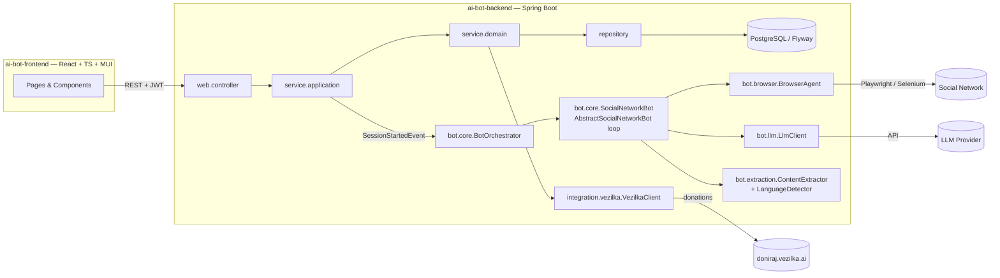

# AI Bot Template — Macedonian Content for doniraj.vezilka.ai

Template for the EMC course project: an **AI bot that intelligently navigates the
interface of a social network** (Facebook, Instagram, X, Reddit, …), **extracts
Macedonian-language content** (posts, images, videos) from the Macedonian online
space, and **donates it to [doniraj.vezilka.ai](https://doniraj.vezilka.ai)** —
the platform for preserving the Macedonian language.

Секој студент добива **една** социјална мрежа (доделена од професорот) и го
имплементира ботот за неа, следејќи ја оваа заедничка архитектура. Шаблонот се
компајлира и се стартува веднаш — вашата задача е да ги имплементирате местата
означени со `TODO(student)`.

## This implementation: gol.mk sports bot

This repository is the **sports variant** of the assignment. The assigned
source is [gol.mk](https://www.gol.mk/), a Macedonian sports portal, modelled
as `SocialNetwork.SPORTS_PORTAL_GOL`. What runs when you start a session:

- `PlaywrightBrowserAgent` drives Chromium through Playwright and turns each page into
  a text snapshot: page text with every link annotated by its URL and every
  image by its source, capped at 10,000 characters.
- `OpenAiCompatibleLlmClient` sends the snapshot and the goal to any
  OpenAI-compatible chat endpoint and parses the JSON `BotDecision`. Developed
  against OpenRouter with `meta-llama/llama-3.3-70b-instruct`.
- `GolMkBot` builds the goal per target: `FEED_URL` extracts the articles
  linked from a URL, `HASHTAG` is a section name such as `кошарка` or `тенис`,
  `KEYWORD` searches for articles about a term, `PROFILE` is a team or
  competition. gol.mk needs no login, so `login()` only opens the homepage.
- `GolMkContentExtractor` extracts full articles (not scoreboard listings),
  asks the LLM for a two-to-three-sentence Macedonian summary, and attaches article
  images as `MediaItem`s. `HeuristicLanguageDetector` scores the text by its
  Cyrillic ratio, boosted by the letters ѓ, ќ, ѕ and penalized by Serbian-only
  letters.
- `VezilkaClientImpl` donates through the Vezilka Public Donation API v1
  (`POST /api/public/v1/donations/text/`, `X-Donation-Api-Key` header), one
  item per post with its own `source_url`. Vezilka moderates synchronously, so
  a submitted batch is settled to ACCEPTED or REJECTED immediately and every
  post stores its Vezilka id and rejection reason (migration `V7`). The
  scheduler path only settles batches that were cut short by the API's rate
  limit. Images are shown in the UI but deliberately not donated: the corpus is
  about language, and sports photos carry none.

Schema additions are `V6` (post summary) and `V7` (Vezilka verdict per post).
The shared abstractions and the agentic loop are unchanged; `VezilkaClient`
keeps every template method and gains `submitTextDonations(List)` beside them,
because the real API is batch-oriented.

### Configuration

The backend reads secrets from `ai-bot-backend/.env` (git-ignored). Copy
`ai-bot-backend/.env.example` and fill in:

| Variable | Purpose |
|----------|---------|
| `JWT_SECRET_KEY` | Base64 secret for signing JWTs (at least 64 bytes) |
| `LLM_BASE_URL`, `LLM_MODEL`, `LLM_API_KEY` | OpenAI-compatible chat endpoint the bot decides with |
| `VEZILKA_API_KEY` | Vezilka Public Donation API key, issued by the course |

Playwright downloads its browser on first run. A session against gol.mk with a
few targets takes a couple of minutes and costs a few cents of LLM usage.

## Architecture

The project follows the course reference architecture (`emc-2026` / e-shop):
layered backend (`web` → `service.application` → `service.domain` → `repository`),
record DTOs with `from()`/`to*()` mapping, Flyway-owned schema, stateless JWT
security, and a React + MUI frontend with the api/contexts/providers/hooks
structure.



### The agentic loop

`AbstractSocialNetworkBot.execute(...)` is a **final template method** — the
generic perceive→decide→act loop is already written:

1. **Perceive** — `BrowserAgent.snapshot()` captures the current page.
2. **Decide** — `LlmClient.decideNextAction(snapshot, goal, history)` picks the
   next `BotAction` (NAVIGATE / CLICK / TYPE / SCROLL / WAIT / EXTRACT / LOGIN / FINISH).
3. **Act** — the action is dispatched onto the `BrowserAgent`; on EXTRACT the
   `ContentExtractor` parses posts and the `LanguageDetector` annotates them
   with a Macedonian-language confidence.
4. Every step is reported through `BotStepListener` and persisted as a
   `BotActionLog`, so the frontend can show a live trace.

You implement the **seams**, not the loop.

## Getting started

Prerequisites: Java 21, Node 20+, Docker.

```bash
# 1. Database
cd ai-bot-backend
docker compose up -d

# 2. Backend  (http://localhost:8080, Swagger at /swagger-ui/index.html)
cp .env.example .env   # then fill in the keys, see Configuration above
./mvnw spring-boot:run

# 3. Frontend (http://localhost:3000)
cd ../ai-bot-frontend
npm install
npm run dev
```

Register and log in — auth is fully working. Every endpoint of the bot domain
returns **HTTP 501 Not Implemented** with the name of the `TODO(student)`
method that is missing; as you implement them, the 501s disappear one by one.

Tests: `./mvnw test` (Docker must be running — Testcontainers starts a real
PostgreSQL). `UserRepositoryTest` is a working example of the expected test
pattern; the `@Disabled` skeletons are yours to implement.

## What you implement — `TODO(student)` milestones

Search the codebase for `TODO(student)` — every marker is part of the
assignment. Grouped by milestone:

| # | Milestone | Where |
|---|-----------|-------|
| 1 | **Browser agent** — drive a real browser (Playwright or Selenium; add the dependency yourself) | `bot/browser/StubBrowserAgent` → your implementation |
| 2 | **LLM decision-making** — prompt an LLM with the page snapshot + goal, parse a structured `BotDecision` | `bot/llm/StubLlmClient` → your implementation |
| 3 | **Your network's bot** — login flow, goal building for each `TargetType` | `bot/core/StubSocialNetworkBot` → e.g. `RedditBot extends AbstractSocialNetworkBot` |
| 4 | **Extraction & language filtering** — parse posts from a snapshot, detect Macedonian | `bot/extraction/StubContentExtractor`, `StubLanguageDetector` |
| 5 | **Orchestration** — run a whole session, persist posts and logs, finish/fail the session | `bot/core/BotOrchestratorImpl` |
| 6 | **Domain & application services** — sessions, posts (paged + filtered), donations | `service/domain/impl/*`, `service/application/impl/*` |
| 7 | **Vezilka integration** — submit donations, poll their status | `integration/vezilka/StubVezilkaClient`, `DonationService.submit/refreshSubmittedStatuses` |
| 8 | **Frontend features** — session form & live log viewer, content browser with filters, donation workflow | `hooks/usePosts,useDonations,useSessionDetails`, `ui/components/session|post|donation/*`, pages |
| 9 | **Tests** — repository + integration tests following the provided pattern | `src/test/java/...` (`@Disabled` skeletons) |

Fully provided (do **not** reimplement): JWT auth (backend + frontend), the
agentic loop, `BotActionLogService`, Flyway migrations V1–V5, the controllers,
exception handlers, and the sessions provider on the frontend (the reference
example of the provider pattern).

## Rules

1. **Do not break the layering.** Controllers speak DTOs and call only
   `service.application` interfaces; application services map DTO↔entity and
   call `service.domain` interfaces; domain services speak entities and call
   repositories. The bot layers never touch repositories — persistence goes
   through the orchestrator's services.
2. **Do not change the shared abstractions** (`BrowserAgent`, `LlmClient`,
   `ContentExtractor`, `LanguageDetector`, `SocialNetworkBot`,
   `VezilkaClient`) or the agentic loop. Extend, don't edit. New migrations go
   in new Flyway versions (`V6__...`), never in edits to V1–V5.
3. **Keep the conventions**: record DTOs with `from()`/`to*()` (no mapper
   libraries), constructor injection, per-controller exception handlers;
   frontend one-folder-per-component, contexts/providers/hooks triads,
   default exports for components and named exports for types.
4. **Secrets stay out of git**: social-network credentials, LLM API keys and
   the Vezilka API key belong in `.env` / environment variables.

## Responsible use

The bot exists to help preserve the Macedonian language. Extract only publicly
accessible content, respect the target network's terms of service and rate
limits (the loop's `bot.max-steps-per-target` bound and WAIT action exist for
a reason), don't collect private or sensitive personal data, and keep the
source URL of everything you donate — provenance matters for the corpus.

## Project layout

```
ai-bot-template/
├── ai-bot-backend/     Spring Boot 3.4 / Java 21 / Maven / PostgreSQL + Flyway
│   └── src/main/java/mk/ukim/finki/aibotbackend/
│       ├── bot/            browser | llm | extraction | core   ← the AI bot seams
│       ├── integration/vezilka/                                 ← doniraj.vezilka.ai client
│       ├── model/          domain | dto | enums | exception
│       ├── repository/  service/domain/  service/application/
│       ├── web/            controller | dto | filter | handler
│       ├── config/  constants/  events/  helpers/  jobs/  listener/
│       └── ...
└── ai-bot-frontend/    React 19 / TypeScript / Vite / MUI
    └── src/
        ├── axios/  api/ (+ api/types/)
        ├── contexts/  providers/  hooks/
        └── ui/  pages | components  (one folder per component)
```
